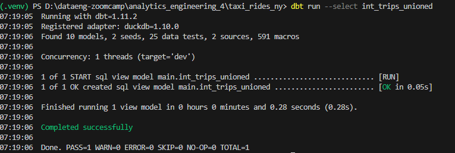
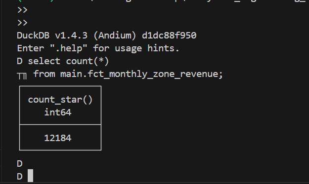
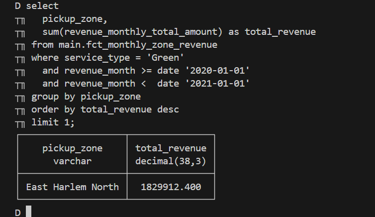
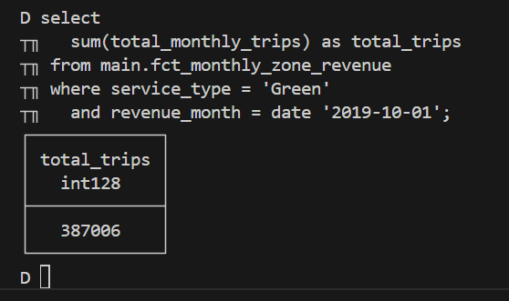
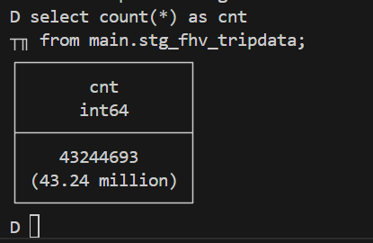

# Module 4 Homework: Analytics Engineering with dbt

In this homework, we'll use the dbt project in `04-analytics-engineering/taxi_rides_ny/` to transform NYC taxi data and answer questions by querying the models.

## Setup

1. Set up your dbt project following the [setup guide](../../../04-analytics-engineering/setup/)
2. Load the Green and Yellow taxi data for 2019-2020 into your warehouse
3. Run `dbt build` to create all models and run tests

After a successful build, you should have models like `fct_trips`, `dim_zones`, and `fct_monthly_zone_revenue` in your warehouse.

---

### Question 1. dbt Lineage and Execution

Given a dbt project with the following structure:

```
models/
├── staging/
│   ├── stg_green_tripdata.sql
│   └── stg_yellow_tripdata.sql
└── intermediate/
    └── int_trips_unioned.sql (depends on stg_green_tripdata & stg_yellow_tripdata)
```

If you run `dbt run --select int_trips_unioned`, what models will be built?

```sql
with green_tripdata as (
    select * from {{ ref('stg_green_tripdata') }}
),
yellow_tripdata as (
    select * from {{ ref('stg_yellow_tripdata') }}
),

trips_unioned as (
    select * from green_tripdata
    union all
    select * from yellow_tripdata
)

select * from trips_unioned
```
<br>



<br>

>Answer:
```
stg_green_tripdata, stg_yellow_tripdata, and int_trips_unioned (upstream dependencies).
```

### Question 2. dbt Tests

You've configured a generic test like this in your `schema.yml`:

```yaml
columns:
  - name: payment_type
    data_tests:
      - accepted_values:
          arguments:
            values: [1, 2, 3, 4, 5]
            quote: false
```

Your model `fct_trips` has been running successfully for months. A new value `6` now appears in the source data.

What happens when you run `dbt test --select fct_trips`?

>Answer:
```
dbt will fail the test, returning a non-zero exit code
```

### Question 3. Counting Records in `fct_monthly_zone_revenue`

After running your dbt project, query the `fct_monthly_zone_revenue` model.

What is the count of records in the `fct_monthly_zone_revenue` model?

```sql
select count(*)
from main.fct_monthly_zone_revenue;

```

<br>



<br>

>Answer:
```
12,184
```


### Question 4. Best Performing Zone for Green Taxis (2020)

Using the `fct_monthly_zone_revenue` table, find the pickup zone with the **highest total revenue** (`revenue_monthly_total_amount`) for **Green** taxi trips in 2020.

Which zone had the highest revenue?

```sql
select
  pickup_zone,
  sum(revenue_monthly_total_amount) as total_revenue
from main.fct_monthly_zone_revenue
where service_type = 'Green'
  and revenue_month >= date '2020-01-01'
  and revenue_month <  date '2021-01-01'
group by pickup_zone
order by total_revenue desc
limit 10;

```


<br>



<br>

>Answer:
```
East Harlem North
```

### Question 5. Green Taxi Trip Counts (October 2019) 

Using the fct_monthly_zone_revenue table, what is the **total number of trips** (total_monthly_trips) for Green taxis in October 2019? 

```sql
select
  sum(total_monthly_trips) as total_trips
from main.fct_monthly_zone_revenue
where service_type = 'Green'
  and revenue_month = date '2019-10-01';

```
<br>



<br>

>Answer:
```
384,624
```

### Question 6. Build a Staging Model for FHV Data

Create a staging model for the **For-Hire Vehicle (FHV)** trip data for 2019.

1. Load the [FHV trip data for 2019](https://github.com/DataTalksClub/nyc-tlc-data/releases/tag/fhv) into your data warehouse
2. Create a staging model `stg_fhv_tripdata` with these requirements:
   - Filter out records where `dispatching_base_num IS NULL`
   - Rename fields to match your project's naming conventions (e.g., `PUlocationID` → `pickup_location_id`)

What is the count of records in `stg_fhv_tripdata`?
 

```sql
select count(*) as cnt
from main.stg_fhv_tripdata;

```
<br>



<br>
>Answer:
```
43,244,693
```

