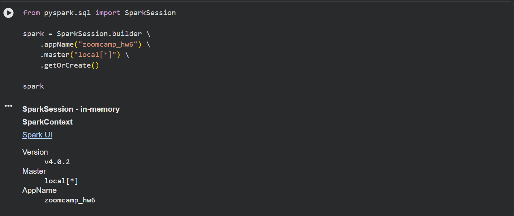
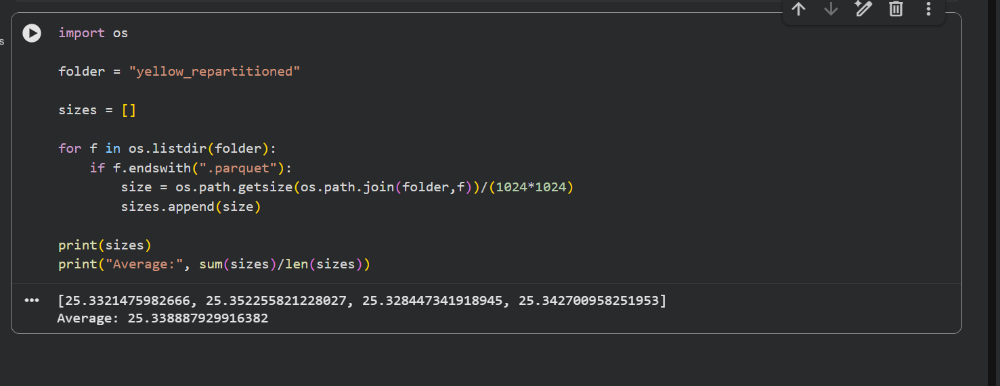
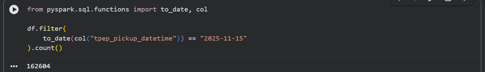
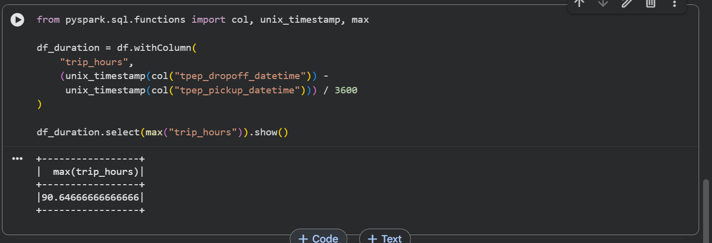
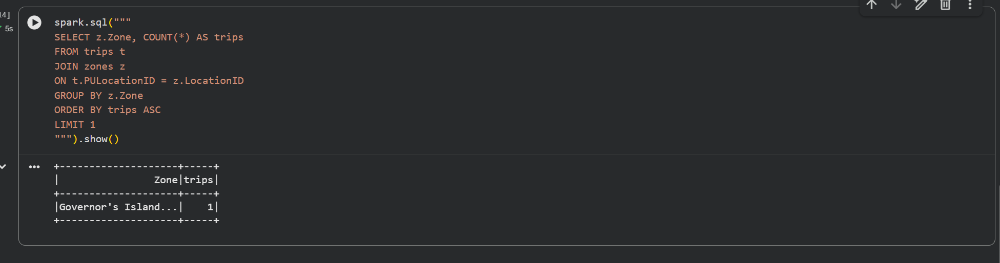

## Question 1: Install Spark and PySpark

- Install Spark
- Run PySpark
- Create a local spark session
- Execute spark.version.

What's the output?

```python

from pyspark.sql import SparkSession

spark = SparkSession.builder \
    .appName("zoomcamp_hw6") \
    .master("local[*]") \
    .getOrCreate()

spark
```

>Answer:
```
SparkSession - in-memory

SparkContext

Spark UI

Version
v4.0.2
Master
local[*]
AppName
zoomcamp_hw6
```
<br>



<br>


## Question 2: Yellow November 2025

Read the November 2025 Yellow into a Spark Dataframe.

Repartition the Dataframe to 4 partitions and save it to parquet.

What is the average size of the Parquet (ending with .parquet extension) Files that were created (in MB)? Select the answer which most closely matches.


```python

import os

folder = "yellow_repartitioned"

sizes = []

for f in os.listdir(folder):
    if f.endswith(".parquet"):
        size = os.path.getsize(os.path.join(folder,f))/(1024*1024)
        sizes.append(size)

print(sizes)
print("Average:", sum(sizes)/len(sizes))
```

>Answer:
```
[25.3321475982666, 25.352255821228027, 25.328447341918945, 25.342700958251953]
Average: 25.338887929916382
```
<br>



<br>

## Question 3: Count records

How many taxi trips were there on the 15th of November?

Consider only trips that started on the 15th of November.


```python

from pyspark.sql.functions import to_date, col

df.filter(
    to_date(col("tpep_pickup_datetime")) == "2025-11-15"
).count()
```

>Answer:
```
162604
```
<br>



<br>

## Question 4: Longest trip

What is the length of the longest trip in the dataset in hours?

```python

from pyspark.sql.functions import col, unix_timestamp, max

df_duration = df.withColumn(
    "trip_hours",
    (unix_timestamp(col("tpep_dropoff_datetime")) - 
     unix_timestamp(col("tpep_pickup_datetime"))) / 3600
)

df_duration.select(max("trip_hours")).show()
```
>Answer:
```
90.64666666666666
```
<br>



<br>

## Question 5: User Interface

Spark's User Interface which shows the application's dashboard runs on which local port?

>Answer:
```
The Spark Web UI (the dashboard where you see jobs, stages, tasks, storage, etc.) runs by default on:
- 4040
```

## Question 6: Least frequent pickup location zone

Load the zone lookup data into a temp view in Spark:

```bash
wget https://d37ci6vzurychx.cloudfront.net/misc/taxi_zone_lookup.csv
```

Using the zone lookup data and the Yellow November 2025 data, what is the name of the LEAST frequent pickup location Zone?

```python
spark.sql("""
SELECT z.Zone, COUNT(*) AS trips
FROM trips t
JOIN zones z
ON t.PULocationID = z.LocationID
GROUP BY z.Zone
ORDER BY trips ASC
LIMIT 1
""").show()
```
>Answer:
```
|Governor's Island...|    1|
```
<br>



<br>


