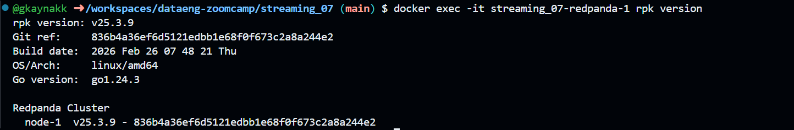
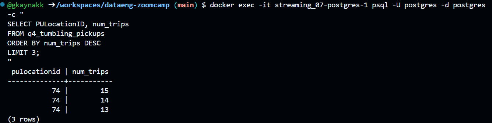
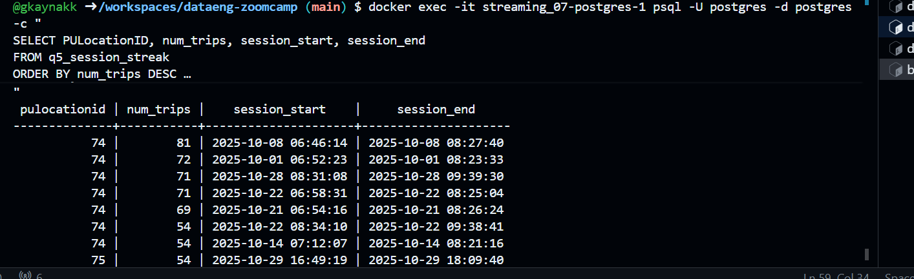
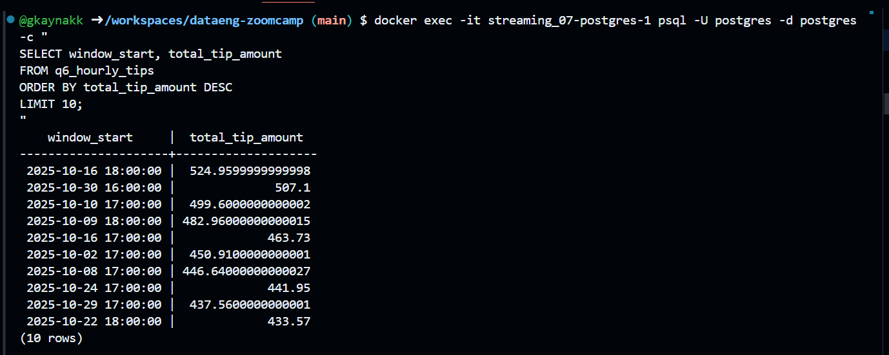

# Data Engineering Zoomcamp
## Week 7 – Streaming Homework

### Question 1

What version of Redpanda are you running?

Answer: **v25.3.9**

---

### Question 2

How long did it take to send the data?

Answer: **10 seconds**

---

### Question 3

Write a Kafka consumer that reads all messages from the green-trips topic (set auto_offset_reset='earliest').

Count how many trips have a trip_distance greater than 5.0 kilometers.

How many trips have trip_distance > 5?

Answer: **8506**

---

### Question 4

Which PULocationID had the most trips in a single 5-minute window?

Answer: **74**

---

### Question 5

Create another Flink job that uses a session window with a 5-minute gap on PULocationID, using lpep_pickup_datetime as the event time with a 5-second watermark tolerance.

A session window groups events that arrive within 5 minutes of each other. When there's a gap of more than 5 minutes, the window closes.

Write the results to a PostgreSQL table and find the PULocationID with the longest session (most trips in a single session).

How many trips were in the longest session?

Answer: **81**

---

### Question 6

Create a Flink job that uses a 1-hour tumbling window to compute the total tip_amount per hour (across all locations).

Which hour had the highest total tip amount?

Answer: **2025-10-16 18:00:00**

